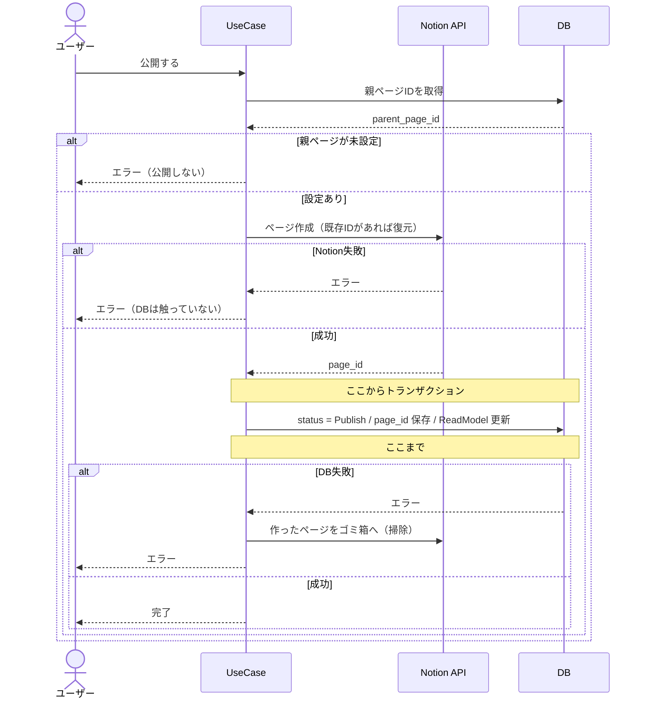

# ② 設計方針と影響範囲

> **この章でやること**
> 「どう作るか」と「どこを触るか」を同時に決め、
> 開発チームに渡せる設計にまとめる。

**方針だけ相談しても意味がありません。** 「こう作ります」には
「既存のここを触ります、だから壊れません」がセットで要ります。

---

## 先に結論

この章で決まる方針です。**根拠は Step 1〜3 で説明します。**

```
公開したら Notion にページを作る。非公開に戻したらゴミ箱へ。
連携に失敗したら、公開・非公開そのものを行わない。

NotionのページIDは既存テーブルに列を足して持つ。
  templates        … 親ページのID（置き場所）
  notes            … ノートページのID
  note_read_models … 画面に出すURLだけ

外部APIは トランザクションの外で、DBより先に呼ぶ。
```

**触る既存コード**

```
🔴 note_command_interactor.go … ChangeStatus / Update
🔴 toReadModel()              … コピー漏れで画面に出なくなる
🟡 migrations / ReadModel まわり / DI配線
```

**最大のリスク**

```
触る2メソッドにテストが無い（usecase のカバレッジ 37.2%）
  → 変更前にテストを書く（PR0）
```

---

## Step 1. 決めることを洗い出す

第1章で作るものは決まりましたが、すぐ実装はできません。

```
要件:「ノートを公開したらNotionにページを作る」

  → 既存の公開処理のどこに、Notion呼び出しを入れる？
  → NotionのページIDは、どこに保存する？
```

**決めることは、要件と既存実装がぶつかる場所にあります。**

| 要件 | 既存はどうなっているか | 決めること |
|---|---|---|
| 公開したらNotionに送る | `ChangeStatus` が status を変えるだけ | ⚠️ どう連動させるか |
| 失敗したら公開しない | 巻き戻す仕組みが無い | ⚠️ どう実現するか |
| 更新に追従する | NotionのページIDを持つ場所が無い | ⚠️ どこに持たせるか |
| 画面に「Notionで開く」を出す | **画面は ReadModel しか読まない** | ⚠️ ReadModelに何を載せるか |
| （親ページ未設定のテンプレート） | 既存は全部未設定になる | ⚠️ 公開させるか止めるか |
| 公開中に編集したら更新 | `Update` がトランザクション内で完結 | ⚠️ 外部APIをどこで呼ぶか |
| 作成者のみ操作可 | `ValidateNoteOwnership` がある | ✅ そのまま使える |
| ノート作成 | `Status: StatusDraft` がハードコード | ✅ 公開状態では作られない |
| 削除時Notionは残す | `Delete` は notes を消すだけ | ✅ 触らなくてよい |

⚠️ の6つが、この章で決めることです。

```
① 公開と連携をどう繋ぐか
② 失敗したらどうするか
③ NotionのページIDをどこに持たせるか
④ ReadModel に何を載せるか
⑤ 親ページが未設定のときどうするか
⑥ 外部API呼び出しをどこで実行するか
```

> **決めることは自分で見つける**
> 要件にもチケットにも「これを決めろ」とは書いてありません。
> この突き合わせを飛ばすと、実装中に気づいて手戻りします。
>
> **既存コードを一通り見ること。** 今回は CQRS なので ReadModel まで見ないと、
> 「画面に出ない」と実装後に気づきます。

---

## Step 2. 決めながら、触る範囲を確定させる

各項目で「こう決める → だからここを触る」まで書きます。

### ① 公開と連携をどう繋ぐか

「公開したらNotionに出す」は第1章で決定済み。
ここでは **status の変化ごとに Notion で何をするか**を定義します。

| きっかけ | Notion側 |
|---|---|
| Draft → Publish（初回） | ページを**作成**（page_id を保存） |
| Draft → Publish（2回目以降） | ゴミ箱から**復元** |
| Publish → Draft | ゴミ箱に**入れる**（page_id は残す） |
| 公開中のノートを編集 | ページを**更新** |
| 下書きのノートを編集 | 何もしない |
| ノートを削除 | 何もしない（Notionページは残す） |

2回目が「作成」でなく「復元」なのは、**Notion APIに物理削除が無い**ためです。
ゴミ箱に入れても同じIDで戻せるので、ページが増えずURLも変わりません。

既存の公開済みノートは status を変えないと連携が走らないので、
詳細ページに **「Notionに未連携です [連携する]」** ボタンを置きます。

**触る範囲**

```
🔴 note_command_interactor.go の ChangeStatus … Notion連携を追加
🔴 note_command_interactor.go の Update       … 公開中なら Notion更新を追加
```

### ② 失敗したらどうするか

「連携が失敗したら公開もしない」は第1章で合意済み。

| 操作 | 連携が失敗したとき |
|---|---|
| 公開する | 公開しない（Draft のまま） |
| 非公開に戻す | 非公開にしない（Publish のまま） |
| 公開中に編集 | 保存しない |

同じボタンを押し直せば再試行になるので、専用UIは不要です。

> **この設計にはコストがあります**
> Notion が落ちている間、ノートを公開できません。
> 「中途半端に公開される方が困る」と合意を得たうえでの判断です。
> **この前提が覆ったら、設計をやり直します。**

### ③ NotionのページIDをどこに持たせるか

ページIDは**2種類**あります。持ち主が違うので、保存先も分かれます。

```
Notion
 └── 日報（親ページ）              ← 人が用意する置き場所
      ├── 9/20 日報（ノートページ） ← 公開時に Mini Notion が作る
      └── 9/21 日報（ノートページ）
```

| ID | 持ち主 | いつ決まるか | 用途 |
|---|---|---|---|
| 親ページ | テンプレート | 人が設定 | どこに作るかの指定 |
| ノートページ | ノート | 公開時に Notion が返す | 更新・復元の対象特定 |

**決定: 既存テーブルに列を追加する**

```sql
ALTER TABLE templates
  ADD COLUMN notion_parent_page_id TEXT NULL;

ALTER TABLE notes
  ADD COLUMN notion_page_id TEXT NULL,
  ADD COLUMN notion_page_url TEXT NULL,
  ADD COLUMN notion_synced_at TIMESTAMPTZ NULL;
```

**NULL 許容は必須です。** NOT NULL にすると既存行が全部エラーになります。

テンプレート編集画面に「NotionのURL」欄を作り、URLの32文字を抽出して保存します。
「日報と週報は同じページ」なら、同じIDを入れるだけです。

> **別テーブルにする案もありました**
> 専用のCRUDと管理画面が必要になります。
> 足すのは合計4列なので、**テーブルを増やす理由が薄い**と判断しました。

**触る範囲**

```
🟡 migrations/              … templates と notes に列追加
🟢 template_repository.go   … 親ページIDの読み書き
🟢 note_repository.go       … page_id の読み書き
🟡 sqlc の生成物            … 再生成が必要（忘れるとビルドが通らない）
```

### ④ ReadModel に何を載せるか

**このアプリは CQRS です。画面は `notes` を読みません。**

```
notes に notion_page_url を足しただけ
   ↓
ReadModel には出てこない
   ↓
画面に「Notionで開く」リンクを出せない
```

ただし**全部載せる必要はありません**。

| 項目 | 画面で使うか | ReadModelに載せるか |
|---|---|---|
| `notion_page_url` | 「Notionで開く」リンク | ✅ **載せる** |
| `notion_page_id` | 内部処理専用 | ❌ 載せない |
| `notion_synced_at` | 今回は表示しない | ❌ 載せない |

内部処理用のIDを載せると、APIレスポンスにも出て混乱のもとです。
必要になったら足せばよいので、**画面に出すものだけ**にします。

**触る範囲**

```
🟡 migrations/                    … note_read_models に notion_page_url 追加
🟡 note.ReadModel 構造体          … NotionPageURL を追加
🔴 toReadModel()                  … コピー処理を1行追加 ← 忘れやすい
🟡 note_read_model_repository.go  … SELECT / UPSERT に追加
🟢 NoteResponse（TypeSpec）       … notionPageUrl を追加（optional）
🟢 readModelToResponse()          … 変換を1行追加
```

> ⚠️ **`toReadModel()` は手動コピーです**
> 書き忘れても**コンパイルが通り、黙って表示されません**。
> **今回いちばん見落としやすい箇所**です。

既存レコードは `notion_page_url` が NULL のままなので、
画面は NULL を想定した実装にします（リンクを出さないだけ）。

### ⑤ 親ページが未設定のときどうするか

「公開＝Notionにも出す」なので、**親ページが無いノートは公開できません**。

```
画面: 公開ボタンを非活性にし、理由を表示 → そもそも押させない
API:  それでもリクエストが来たらエラー   → 直叩き・設定削除への備え
```

> **画面だけで止めてはいけない**
> APIは画面を信用しません。直接叩かれても不正な状態を作らせないためです。
> 逆にAPIのエラーだけに頼るのも駄目で、押せるボタンがエラーになるのは手戻りです。

既存テンプレートは全部未設定なので、**リリース前に手作業で設定**します。
新規作成時は親ページURLを必須にします。

### ⑥ 外部API呼び出しをどこで実行するか

②で「失敗したらロールバック」と決めたことで、矛盾が生じます。

```
ロールバックしたい → 同じトランザクションに入れたくなる
でも、トランザクションの中で外部APIを呼ぶのは厳禁
```

**なぜ厳禁か**

```
Notion APIが遅い（3秒） → その間トランザクションが開きっぱなし
                        → 行ロックが保持される
タイムアウト（30秒）     → コネクションプール枯渇 → 全体障害
```

**解決: 順序を変える**

```
❌ DBを更新 → Notion呼び出し → 失敗したらDBを戻す（巻き戻しが必要）
✅ Notion呼び出し → 成功したらDBを更新（失敗してもDBを触っていない）
```

```go
// ステップ1: 先にNotionを呼ぶ（トランザクションの外）
result, err := u.notion.CreatePage(ctx, parentID, title, blocks)
if err != nil {
    return fmt.Errorf("Notionへの連携に失敗しました: %w", err)
}

// ステップ2: 成功したのでDBを更新（トランザクションの中）
if err := u.tx.WithinTransaction(ctx, func(txCtx context.Context) error {
    ...
}); err != nil {
    // このDB更新で新しく作ったページだけを片付ける
    if trashErr := u.notion.Trash(ctx, result.PageID); trashErr != nil {
        log.Error("作成したページが残りました", "page_id", result.PageID)
    }
    return err
}
```

**孤児ページの掃除を入れます。** DB更新に失敗すると page_id が保存されず、
**そのページを二度と特定できなくなる**ためです。

掃除自体も失敗しえますが、二重に落ちる確率は低く、落ちても状況は悪化しません。

> **消していいのは「今このとき作ったページ」だけです**
> 再公開（復元）や公開中の編集でも、DB更新は失敗しえます。
> そこで同じ掃除を動かすと、**もともとあったページをゴミ箱に入れてしまいます**。
>
> ```
> 初回公開 → ページを作った直後  → 消してよい（IDが失われるため）
> 再公開   → 復元した直後        → 消してはいけない
> 編集     → 更新した直後        → 消してはいけない
> ```
>
> 「失敗したら戻す」と考えると全部消したくなりますが、
> **戻す先は操作ごとに違います**。

**Notion APIを呼ぶコードの置き場所**

DBアクセスと同じ **Gateway層**です。`gateway/db/` の隣に置きます。

```
internal/adapter/gateway/
  ├── db/            … DBアクセス（既存）
  │   └── sqlc/note_repository.go
  └── externalapi/   … 外部API ← ここ
      └── notion/client.go
```

`gateway/externalapi/` は設計ガイドに
**「外部API（将来用）」として用意されている空ディレクトリ**です。

UseCase層は `port.NotionClient` インターフェース越しに呼ぶので、
**中身がHTTPであることを知りません**（DBと同じ扱い）。

**触る範囲**

```
🟢 gateway/externalapi/notion/ … 新規作成（既存コードへの影響なし）
🟡 config.go                   … NotionAPIKey を追加（🚨 必須チェックにしない）
🟡 initializer.go              … DI配線を追加。NewServer の引数が増える
```

> **新機能の設定を必須にしない**
> ```go
> // ❌ 本番で設定を忘れるとアプリ全体が起動しなくなる
> if os.Getenv("NOTION_API_KEY") == "" {
>     return nil, errors.New("NOTION_API_KEY is not set")
> }
> ```
> 未設定でも起動し、連携実行時にだけ検証します。

---

## Step 3. 壊れない根拠を揃える

各項目で「触る範囲」を書いてきました。
ここでは**そこから何が壊れうるか**だけを詰めます。

### 最大のリスク: 触るコードにテストが無い

`NoteCommandInteractor` を変更しますが、**このファイルにはテストがありません**。

```
account_interactor_test.go       ✅ ある
template_interactor_test.go      ✅ ある
note_command_interactor_test.go  ❌ ない  ← ここを変更する
```

実測カバレッジ（`go test ./internal/... -cover`）

```
domain/service           100.0%
adapter/http/controller   84.7%
usecase                   37.2%  🚨 ← ここ
```

**対策: 変更する前にテストを書く（PR0）**

```
PR0: 既存の振る舞いをテストで固定する
       ↓
PR4: Notion連携を追加
       ↓ 既存テストが通れば、壊していないと言える
```

> 「ついでに直す」（別チケット）ではなく、
> **触るコードの安全確保**なので今回のスコープです。

### リスク一覧

| # | リスク | 影響度 | 対策 |
|---|---|:---:|---|
| R1 | テストのない `ChangeStatus` / `Update` を壊す | 🔴 高 | PR0で先にテストを書く |
| R2 | `toReadModel()` のコピー漏れで画面に出ない | 🔴 高 | QAケースで表示を確認 |
| R3 | Notion障害中にノートを公開できない | 🔴 高 | 設計上の割り切り。**合意が前提** |
| R4 | `NOTION_API_KEY` 未設定で全体が起動しない | 🔴 高 | 必須チェックを入れない |
| R5 | sqlc 再生成漏れ | 🟡 中 | CIで差分チェック |
| R6 | `NewServer` 引数追加で gRPC側が壊れる | 🟡 中 | grep で全箇所確認 |

> **R3 は性質が違う**
> 「対策する」ものではなく、**選んだトレードオフ**です。
> 消せないので、**合意を取ることが対策**になります。

### 止め方

```
機能だけ停止  … NOTION_API_KEY を空にする（DBもコードも触らない）
コード        … revert（既存への変更が最小のため戻しやすい）
DB            … down マイグレーション
                ⚠️ page_id が消えるので、再適用時に重複ページができる
```

---

## Step 4. 開発チームに渡す

第1章では依頼元に「動きの説明」を渡しました。
ここで渡すのは開発チーム向けなので、**決定・理由・触る範囲・リスク**を書きます。

### 決定事項

| # | 決めたこと | 決定 |
|---|---|---|
| ① | statusごとの動作 | 初回は作成、再公開は復元、非公開はゴミ箱、削除は何もしない |
| ② | 失敗したら | 公開・非公開も行わない（ロールバック） |
| ③ | ページIDの持ち方 | 親ページIDは `templates`、ノートページIDは `notes` に列追加 |
| ④ | ReadModelに載せるもの | `notion_page_url` のみ |
| ⑤ | 親ページが未設定 | 画面は非活性、APIはエラー |
| ⑥ | 外部API実行位置 | トランザクション外。Notionを先に呼ぶ。DB失敗時はページを掃除 |

### データ構造

**新しいテーブルは作りません。既存3つに列を足すだけです。**

```
templates（既存）
  + notion_parent_page_id   親ページのID

notes（既存・書き込み用）
  + notion_page_id          ノートページのID（内部処理用）
  + notion_page_url         「Notionで開く」リンク用
  + notion_synced_at        最終連携日時

note_read_models（既存・読み取り用）
  + notion_page_url         ← 画面に出すのはこれだけ
```

すべて NULL 許容。既存データは NULL のまま壊れません。

> **CQRSなので2箇所に持ちます**
> `notes` が正で、`note_read_models` はそのコピーです。
> `toReadModel()` でコピーしないと画面に出ません。

### 処理の流れ



非公開・編集も同じ順序（Notion → DB）です。

### 確認してほしいこと

````markdown
## 確認してほしいこと

### 合意が必須
1. **Notion が落ちている間、ノートを公開できなくなります**
   外部サービスの障害が自社機能を止める構造です。
   「公開したのにNotionにない」状態を防ぐことを優先しました。

2. **リリース前に、全テンプレートへ親ページの設定が必要です**
   設定漏れがあると、そのテンプレートのノートが公開不能になります。

### 意見がほしい
- `NoteCommandInteractor` にテストが無いため、PR0で先に書きます。
  この順序でよいか（別チケットにすると無防備な変更になります）。
- Notion成功後にDB更新が失敗したら、作ったページをゴミ箱に入れます。
  その掃除も失敗した場合はログに page_id を残すだけです。
- 既存の `ChangeStatus` にトランザクションが無いのは意図的ですか。

### 報告のみ
- 新しいテーブルは作りません（既存3つに列追加）
- CQRSなので ReadModel にも `notion_page_url` を持たせます
- 触るファイル一覧とリスク一覧は上記のとおり
````

> **「見てください」では何も返ってきません**
> 合意が要るものを先頭に、理由つきで書きます。

---

## チェックリスト

```
【決めることを見つける】
□ 要件を1行ずつ既存コードに当てたか
□ 既存コードを一通り見たか（CQRSならReadModelまで）
□ 「既存の仕組みに乗るだけ」のものを除外したか

【決める】
□ 決定の理由を書いたか
□ 各項目で「触る範囲」まで確定させたか
□ 「将来こうなったら見直す」を書いたか

【根拠を揃える】
□ 触るコードのテストカバレッジを実測したか
□ テストが無いなら、先に書く計画にしたか
□ リスク一覧とロールバック手順を書いたか

【渡す】
□ 合意が必須のものを先頭に置いたか
□ 「意見がほしい」と「報告のみ」を分けたか
```

---

## 次の章へ

作り方と触る範囲が決まりました。
次は「どう動けば合格か」を決めます。

👉 [03_test_strategy.md](./03_test_strategy.md)
