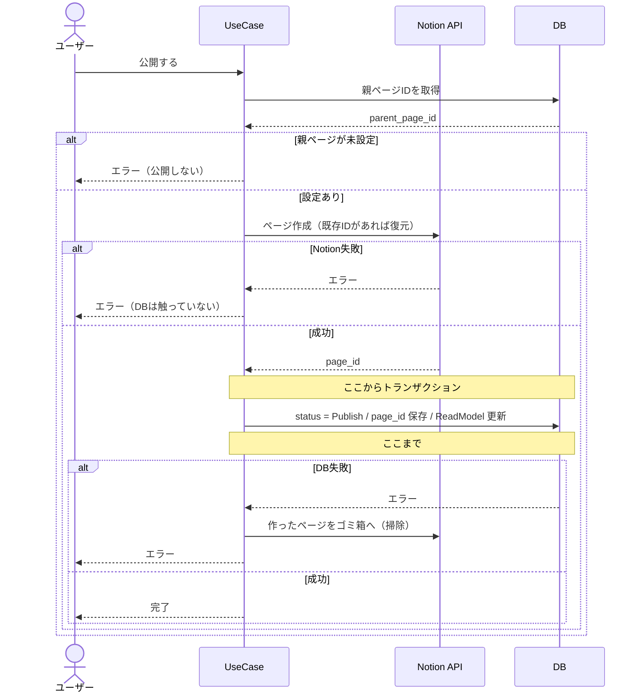

# ② 設計方針と影響範囲

> **この章でやること**
> 「どう作るか」と「どこを触るか」を同時に決め、
> 開発チームに渡せる設計にまとめる。

**方針だけ相談しても意味がありません。** 「こう作ります」には
「既存のここを触ります、だから壊れません」がセットで要ります。

---

## 先に結論

この章で決まる方針です。**根拠は Step 1〜4 で説明します。**

```
公開したら Notion にページを作る。非公開に戻したらゴミ箱へ。
連携に失敗したら、公開・非公開そのものを行わない。

NotionのページIDは既存テーブルに列を足して持つ。
  templates        … 親ページのID（置き場所）
  notes            … ノートページのID
  note_read_models … 画面に出すURLだけ

外部APIは トランザクションの外で、DBより先に呼ぶ。
入力の検証は、外部APIを呼ぶ前に済ませる。

この機能より前に公開されたノートは、手動で連携できるようにする。
```

**触る既存コード**

```
🔴 note_command_interactor.go … ChangeStatus / Update
🔴 toReadModel()              … コピー漏れで画面に出なくなる
🟡 migrations / ReadModel まわり / DI配線
🔴 ReplaceFields              … 使用中テンプレートを編集できるようにする
```

**最大のリスク**

```
触る2メソッドにテストが無い（usecase のカバレッジ 37.2%）
  → 変更前にテストを書く（PR0）
```

---

## Step 1. ユースケースを洗い出す

第1章で作るものは決まりましたが、すぐ実装はできません。

**まず関係するユースケースを全部並べます。** 要件だけを起点にすると、
要件に書かれていない操作が落ちます。

```
要件:「ノートを公開したらNotionにページを作る」
  → 公開の話しか出てこない
  → 「公開済みのノートはどうなる？」は要件に書いていない
```

### 操作を並べる

この機能で、Notionが絡む操作を並べます。既存の操作も含めます。

| # | ユースケース | 前 | 後 | Notion側で起きること |
|---|---|---|---|---|
| UC-1 | ノートを公開する（初回） | 下書き | 公開 | ページを作る |
| UC-2 | 公開中のノートを編集する | 公開 | 公開 | ページを更新する |
| UC-3 | ノートを非公開に戻す | 公開 | 下書き | ページをゴミ箱に入れる |
| UC-4 | ノートを非公開から公開する（2回目以降） | 下書き | 公開 | ゴミ箱から元に戻す |
| UC-5 | ノートを削除する | 公開/下書き | 削除 | 何もしない |
| UC-6 | 下書きを編集する | 下書き | 下書き | 何もしない |
| UC-7 | テンプレートにNotionの親ページを設定する | — | — | 何もしない |
| UC-8 | **公開済みだが未連携のノートを連携する** | 公開 | 公開 | ページを作る |
| UC-9 | 入力エラーで操作が失敗する | 変わらない | 変わらない | **何もしない** |

**UC-8 と UC-9 は要件に書かれていません。**

- UC-8: この機能より前に公開されたノートは、公開操作が起きないので連携されない
- UC-9: 「失敗したら何もしない」は当たり前すぎて誰も書かない

**要件に無いものは、この段階でビジネス側に確認します。**

> **洗い出しの型**
> ```
> 1. 要件に書いてある操作を並べる
> 2. 各操作の「前」と「後」のデータの状態を書く
> 3. 既存データがどうなるかを考える      ← UC-8 はここで出る
> 4. 失敗したときを考える                ← UC-9 はここで出る
> ```

### 確認した結果

要件に無かった UC-8・UC-9 を確認しました。

| # | 確認したこと | 回答 |
|---|---|---|
| UC-8 | 公開済みのノートも連携する？ | する。ただし勝手に連携せず、ユーザーが押して実行する |
| UC-9 | 連携に失敗したら公開だけでも通す？ | 通さない。中途半端に公開される方が困る |

**決まったユースケース**

```
UC-8  公開済み・未連携のノートに「連携する」ボタンを出す
      → 押したときだけ連携する

UC-9  入力エラーで失敗したら、Notionには何も起きない
      → 公開も連携も行わない
```

ここまでで作るものが確定しました。次は既存コードを読みます。

---

## Step 2. 既存コードとの差分を出す

**ユースケースごとに、既存コードが今どうなっているかを読みます。**
「どのファイルを触るか」ではなく「そのコードが今どう書かれているか」です。

| ユースケース | 既存コードの現状 | 差分 |
|---|---|---|
| UC-1〜4 公開・編集・非公開 | `ChangeStatus` / `Update` が status と本文を変えるだけ | ⚠️ 外部API呼び出しを足す |
| UC-1 のページID保存 | NotionのページIDを持つ場所が無い | ⚠️ 保存先を決める |
| 画面に「Notionで開く」 | **画面は ReadModel しか読まない** | ⚠️ ReadModelに載せる |
| UC-7 親ページの設定 | **使用中テンプレートは編集画面に入れない**<br>`ReplaceFields` が項目を全削除→再作成するため | ⚠️ 設定できるようにする |
| UC-8 手動連携 | **該当する操作もAPIも無い** | ⚠️ 新規で作る |
| UC-9 失敗時 | 検証がトランザクション内にある | ⚠️ 外部API呼び出しとの順序を決める |
| 権限チェック | `ValidateNoteOwnership` がある | ✅ そのまま使える |
| UC-5 削除 | `Delete` は notes を消すだけ | ✅ 触らなくてよい |

> **「触るファイル」ではなく「そのコードの中身」を見る**
> ファイル名を並べただけでは、`ReplaceFields` が全削除→再作成だったことに
> 気づけません。気づかないと「テンプレートに親ページを設定する」という
> 一番の前提が、実装の最後まで通らないままになります。
>
> **既存コードを一通り読むこと。** 今回は CQRS なので ReadModel まで
> 見ないと、「画面に出ない」と実装後に気づきます。

### 既存とぶつかったものは、もう一度確認する

UC-7 は要件にあるユースケースですが、**既存実装がそれを許していません**。
使用中テンプレートを編集できるようにすると、項目まで変更できてしまいます。

| # | 確認したこと | 回答 |
|---|---|---|
| UC-7 | 既にノートがあるテンプレートにも、あとから親ページを設定してよい？ | 設定できるようにする。ただし項目の変更で既存ノートの内容が変わるのは駄目 |

```
UC-7' 使用中テンプレートでも、Notionの親ページは設定できる
      → ただし項目は変更できない
```

> **確認は1回で終わりません**
> Step 1 で聞けるのは「要件に無い操作」まで。
> 既存コードとぶつかる話は、読んでみるまで分かりません。

### 決めること

差分の ⚠️ から、決めることが出ます。

```
① 公開と連携をどう繋ぐか          （UC-1〜4）
② 失敗したらどうするか            （UC-1〜4）
③ NotionのページIDをどこに持たせるか（UC-1, UC-7）
④ ReadModel に何を載せるか        （画面表示）
⑤ 親ページが未設定のときどうするか  （UC-7, UC-9）
⑥ 外部API呼び出しをどこで実行するか （UC-1〜4, UC-9）
⑦ 既存データをどう救済するか       （UC-8）
```

---

## Step 3. 決めながら、触る範囲を確定させる

各項目で「こう決める → だからここを触る」まで書きます。

### ① 公開と連携をどう繋ぐか

「公開したらNotionに出す」は第1章で決定済み。
ここでは **status の変化ごとに Notion で何をするか**を定義します。

| きっかけ | Notion側 |
|---|---|
| Draft → Publish（初回） | ページを**作成**（page_id を保存） |
| Draft → Publish（2回目以降） | ゴミ箱から**復元** |
| Publish → Draft | ゴミ箱に**入れる**（page_id は残す） |
| 公開中のノートを編集 | ページを**更新** |
| 下書きのノートを編集 | 何もしない |
| ノートを削除 | 何もしない（Notionページは残す） |

2回目が「作成」でなく「復元」なのは、**Notion APIに物理削除が無い**ためです。
ゴミ箱に入れても同じIDで戻せるので、ページが増えずURLも変わりません。

既存の公開済みノートは status を変えないと連携が走らないので、
詳細ページに **「Notionに未連携です [連携する]」** ボタンを置きます。

**触る範囲**

```
🔴 note_command_interactor.go の ChangeStatus … Notion連携を追加
🔴 note_command_interactor.go の Update       … 公開中なら Notion更新を追加
```

### ② 失敗したらどうするか

「連携が失敗したら公開もしない」は第1章で合意済み。

| 操作 | 連携が失敗したとき |
|---|---|
| 公開する | 公開しない（Draft のまま） |
| 非公開に戻す | 非公開にしない（Publish のまま） |
| 公開中に編集 | 保存しない |

同じボタンを押し直せば再試行になるので、専用UIは不要です。

> **この設計にはコストがあります**
> Notion が落ちている間、ノートを公開できません。
> 「中途半端に公開される方が困る」と合意を得たうえでの判断です。
> **この前提が覆ったら、設計をやり直します。**

### ③ NotionのページIDをどこに持たせるか

ページIDは**2種類**あります。持ち主が違うので、保存先も分かれます。

```
Notion
 └── 日報（親ページ）              ← 人が用意する置き場所
      ├── 9/20 日報（ノートページ） ← 公開時に Mini Notion が作る
      └── 9/21 日報（ノートページ）
```

| ID | 持ち主 | いつ決まるか | 用途 |
|---|---|---|---|
| 親ページ | テンプレート | 人が設定 | どこに作るかの指定 |
| ノートページ | ノート | 公開時に Notion が返す | 更新・復元の対象特定 |

**決定: 既存テーブルに列を追加する**

```sql
ALTER TABLE templates
  ADD COLUMN notion_parent_page_id TEXT NULL;

ALTER TABLE notes
  ADD COLUMN notion_page_id TEXT NULL,
  ADD COLUMN notion_page_url TEXT NULL,
  ADD COLUMN notion_synced_at TIMESTAMPTZ NULL;
```

**NULL 許容は必須です。** NOT NULL にすると既存行が全部エラーになります。

テンプレート編集画面に「NotionのURL」欄を作り、URLの32文字を抽出して保存します。
「日報と週報は同じページ」なら、同じIDを入れるだけです。

> **別テーブルにする案もありました**
> 専用のCRUDと管理画面が必要になります。
> 足すのは合計4列なので、**テーブルを増やす理由が薄い**と判断しました。

**触る範囲**

```
🟡 migrations/              … templates と notes に列追加
🟢 template_repository.go   … 親ページIDの読み書き
🟢 note_repository.go       … page_id の読み書き
🟡 sqlc の生成物            … 再生成が必要（忘れるとビルドが通らない）
🔴 ReplaceFields / SyncFields … 使用中は id を保って更新する（後述）
🔴 テンプレート編集画面      … 使用中でも開けるようにする
```

> **値を置く場所を決めたら、「誰がどう入れるか」まで見る**
>
> 親ページIDを `templates` に持たせると決めましたが、
> **既存テンプレートはノートで使用中で、編集画面に入れません**。
> 設定したいテンプレートほど設定できない、という状態でした。
>
> 原因は `ReplaceFields` が項目を毎回全削除→再作成していたことです。
> ノートが参照する項目を消せずDBエラーになるため、
> 画面が「使用中は編集不可」で回避していました。
>
> ```
> 修正前  つねに 全削除 → 再作成    使用中だと必ず失敗
> 修正後  未使用なら 全削除 → 再作成
>         使用中なら id を保って更新   ノートの参照が切れない
> ```
>
> **どちらを使うかは UseCase が決めます。** リポジトリは
> 「言われた方法で保存する」だけにし、判断を持たせません。
>
> **列を足しても、値を入れる経路が塞がっていれば機能しません。**

### ④ ReadModel に何を載せるか

**このアプリは CQRS です。画面は `notes` を読みません。**

```
notes に notion_page_url を足しただけ
   ↓
ReadModel には出てこない
   ↓
画面に「Notionで開く」リンクを出せない
```

ただし**全部載せる必要はありません**。

| 項目 | 画面で使うか | ReadModelに載せるか |
|---|---|---|
| `notion_page_url` | 「Notionで開く」リンク | ✅ **載せる** |
| `notion_page_id` | 内部処理専用 | ❌ 載せない |
| `notion_synced_at` | 今回は表示しない | ❌ 載せない |

内部処理用のIDを載せると、APIレスポンスにも出て混乱のもとです。
必要になったら足せばよいので、**画面に出すものだけ**にします。

**触る範囲**

```
🟡 migrations/                    … note_read_models に notion_page_url 追加
🟡 note.ReadModel 構造体          … NotionPageURL を追加
🔴 toReadModel()                  … コピー処理を1行追加 ← 忘れやすい
🟡 note_read_model_repository.go  … SELECT / UPSERT に追加
🟢 NoteResponse（TypeSpec）       … notionPageUrl を追加（optional）
🟢 readModelToResponse()          … 変換を1行追加
```

> ⚠️ **`toReadModel()` は手動コピーです**
> 書き忘れても**コンパイルが通り、黙って表示されません**。
> **今回いちばん見落としやすい箇所**です。

既存レコードは `notion_page_url` が NULL のままなので、
画面は NULL を想定した実装にします（リンクを出さないだけ）。

### ⑤ 親ページが未設定のときどうするか

「公開＝Notionにも出す」なので、**親ページが無いノートは公開できません**。

```
画面: 公開ボタンを非活性にし、理由を表示 → そもそも押させない
API:  それでもリクエストが来たらエラー   → 直叩き・設定削除への備え
```

> **画面だけで止めてはいけない**
> APIは画面を信用しません。直接叩かれても不正な状態を作らせないためです。
> 逆にAPIのエラーだけに頼るのも駄目で、押せるボタンがエラーになるのは手戻りです。

既存テンプレートは全部未設定なので、**リリース前に手作業で設定**します。
新規作成時は親ページURLを必須にします。

**そのために、使用中テンプレートでも編集画面に入れるようにします。**

| 項目 | 使用中のとき | 理由 |
|---|---|---|
| テンプレート名 | 編集できる | ノートの内容に影響しない |
| 親ページURL | **編集できる** | 同上。ここが設定できないと連携が始められない |
| 項目（fields） | 編集できない | ノートが内容を保持しているため |

項目は画面で非活性にし、APIでも拒否します（⑤と同じ二重の守り）。

### ⑥ 外部API呼び出しをどこで実行するか

②で「失敗したらロールバック」と決めたことで、矛盾が生じます。

```
ロールバックしたい → 同じトランザクションに入れたくなる
でも、トランザクションの中で外部APIを呼ぶのは厳禁
```

**なぜ厳禁か**

```
Notion APIが遅い（3秒） → その間トランザクションが開きっぱなし
                        → 行ロックが保持される
タイムアウト（30秒）     → コネクションプール枯渇 → 全体障害
```

**解決: 順序を変える**

```
❌ DBを更新 → Notion呼び出し → 失敗したらDBを戻す（巻き戻しが必要）
✅ Notion呼び出し → 成功したらDBを更新（失敗してもDBを触っていない）
```

```go
// ステップ1: 先にNotionを呼ぶ（トランザクションの外）
result, err := u.notion.CreatePage(ctx, parentID, title, blocks)
if err != nil {
    return fmt.Errorf("Notionへの連携に失敗しました: %w", err)
}

// ステップ2: 成功したのでDBを更新（トランザクションの中）
if err := u.tx.WithinTransaction(ctx, func(txCtx context.Context) error {
    ...
}); err != nil {
    // このDB更新で新しく作ったページだけを片付ける
    if trashErr := u.notion.Trash(ctx, result.PageID); trashErr != nil {
        log.Error("作成したページが残りました", "page_id", result.PageID)
    }
    return err
}
```

**孤児ページの掃除を入れます。** DB更新に失敗すると page_id が保存されず、
**そのページを二度と特定できなくなる**ためです。

掃除自体も失敗しえますが、二重に落ちる確率は低く、落ちても状況は悪化しません。

> **消していいのは「今このとき作ったページ」だけです**
> 再公開（復元）や公開中の編集でも、DB更新は失敗しえます。
> そこで同じ掃除を動かすと、**もともとあったページをゴミ箱に入れてしまいます**。
>
> ```
> 初回公開 → ページを作った直後  → 消してよい（IDが失われるため）
> 再公開   → 復元した直後        → 消してはいけない
> 編集     → 更新した直後        → 消してはいけない
> ```
>
> 「失敗したら戻す」と考えると全部消したくなりますが、
> **戻す先は操作ごとに違います**。

**Notion APIを呼ぶコードの置き場所**

DBアクセスと同じ **Gateway層**です。`gateway/db/` の隣に置きます。

```
internal/adapter/gateway/
  ├── db/            … DBアクセス（既存）
  │   └── sqlc/note_repository.go
  └── externalapi/   … 外部API ← ここ
      └── notion/client.go
```

`gateway/externalapi/` は設計ガイドに
**「外部API（将来用）」として用意されている空ディレクトリ**です。

UseCase層は `port.NotionClient` インターフェース越しに呼ぶので、
**中身がHTTPであることを知りません**（DBと同じ扱い）。

**触る範囲**

```
🟢 gateway/externalapi/notion/ … 新規作成（既存コードへの影響なし）
🟡 config.go                   … NotionAPIKey を追加（🚨 必須チェックにしない）
🟡 initializer.go              … DI配線を追加。NewServer の引数が増える
```

> **新機能の設定を必須にしない**
> ```go
> // ❌ 本番で設定を忘れるとアプリ全体が起動しなくなる
> if os.Getenv("NOTION_API_KEY") == "" {
>     return nil, errors.New("NOTION_API_KEY is not set")
> }
> ```
> 未設定でも起動し、連携実行時にだけ検証します。

### ⑦ 既存データをどう救済するか

連携は**公開操作がきっかけ**です。そのため、この機能より前に公開された
ノートには何も起きません。

```
公開済みのノート  → status は変わらない → 連携が走らない → ずっと未連携
```

一度下書きに戻して再公開すれば連携されますが、その間ノートが一覧から
消えます。読み手のいるノートでこれは避けたいところです。

**statusを変えずに、連携だけ実行する操作を用意します。**

```
POST /notes/{id}/notion-sync    公開済み & 未連携のときだけ実行できる
```

画面には「このノートはまだNotionに連携されていません」と出し、
連携ボタンを置きます。

**触る範囲**

```
🔴 api-schema/typespec/  … エンドポイントを追加（契約が変わる）
🔴 note_command_interactor.go … SyncToNotion を追加
🟡 ノート詳細画面        … 連携ボタン
```

> **要件に書かれない操作は、ユースケースから拾う**
> ビジネス側は「公開したら連携する」としか言いません。
> 既存データがどうなるかは、作る側が考えることです。
>
> Step 1 でユースケースを並べたのは、これを拾うためです。
> **契約（API定義）を決める前に気づかないと、後から作り直しになります。**

---

## Step 4. 壊れない根拠を揃える

各項目で「触る範囲」を書いてきました。
ここでは**そこから何が壊れうるか**だけを詰めます。

### 最大のリスク: 触るコードにテストが無い

`NoteCommandInteractor` を変更しますが、**このファイルにはテストがありません**。

```
account_interactor_test.go       ✅ ある
template_interactor_test.go      ✅ ある
note_command_interactor_test.go  ❌ ない  ← ここを変更する
```

実測カバレッジ（`go test ./internal/... -cover`）

```
domain/service           100.0%
adapter/http/controller   84.7%
usecase                   37.2%  🚨 ← ここ
```

**対策: 変更する前にテストを書く（PR0）**

```
PR0: 既存の振る舞いをテストで固定する
       ↓
PR4: Notion連携を追加
       ↓ 連携に関係ない箇所のテストが通れば、そこは壊していない
```

**連携に関係する箇所は、テストも一緒に変わります。** そこは
「なぜ変えたか」を説明できることが条件です。

```
❌ 落ちたので期待値を書き換えた
⭕️ 検証をトランザクションの前に移したので、期待値もそれに合わせた
```

> 「ついでに直す」（別チケット）ではなく、
> **触るコードの安全確保**なので今回のスコープです。

### リスク一覧

| # | リスク | 影響度 | 対策 |
|---|---|:---:|---|
| R1 | テストのない `ChangeStatus` / `Update` を壊す | 🔴 高 | PR0で先にテストを書く |
| R2 | `toReadModel()` のコピー漏れで画面に出ない | 🔴 高 | QAケースで表示を確認 |
| R3 | Notion障害中にノートを公開できない | 🔴 高 | 設計上の割り切り。**合意が前提** |
| R4 | `NOTION_API_KEY` 未設定で全体が起動しない | 🔴 高 | 必須チェックを入れない |
| R5 | sqlc 再生成漏れ | 🟡 中 | CIで差分チェック |
| R6 | `NewServer` 引数追加で gRPC側が壊れる | 🟡 中 | grep で全箇所確認 |

> **R3 は性質が違う**
> 「対策する」ものではなく、**選んだトレードオフ**です。
> 消せないので、**合意を取ることが対策**になります。

### 止め方

```
機能だけ停止  … NOTION_API_KEY を空にする（DBもコードも触らない）
コード        … revert（既存への変更が最小のため戻しやすい）
DB            … down マイグレーション
                ⚠️ page_id が消えるので、再適用時に重複ページができる
```

---

## Step 5. 開発チームに渡す

第1章では依頼元に「動きの説明」を渡しました。
ここで渡すのは開発チーム向けなので、**決定・理由・触る範囲・リスク**を書きます。

### 決定事項

| # | 決めたこと | 決定 |
|---|---|---|
| ① | statusごとの動作 | 初回は作成、再公開は復元、非公開はゴミ箱、削除は何もしない |
| ② | 失敗したら | 公開・非公開も行わない（ロールバック） |
| ③ | ページIDの持ち方 | 親ページIDは `templates`、ノートページIDは `notes` に列追加 |
| ④ | ReadModelに載せるもの | `notion_page_url` のみ |
| ⑤ | 親ページが未設定 | 画面は非活性、APIはエラー |
| ⑥ | 外部API実行位置 | トランザクション外。Notionを先に呼ぶ。DB失敗時はページを掃除 |
| ⑦ | 既存データの救済 | `POST /notes/{id}/notion-sync` で手動連携 |

### データ構造

**新しいテーブルは作りません。既存3つに列を足すだけです。**

```
templates（既存）
  + notion_parent_page_id   親ページのID

notes（既存・書き込み用）
  + notion_page_id          ノートページのID（内部処理用）
  + notion_page_url         「Notionで開く」リンク用
  + notion_synced_at        最終連携日時

note_read_models（既存・読み取り用）
  + notion_page_url         ← 画面に出すのはこれだけ
```

すべて NULL 許容。既存データは NULL のまま壊れません。

> **CQRSなので2箇所に持ちます**
> `notes` が正で、`note_read_models` はそのコピーです。
> `toReadModel()` でコピーしないと画面に出ません。

### 処理の流れ



非公開・編集も同じ順序（Notion → DB）です。

### 渡す文書の最後に、確認したいことを書く

````markdown
## 開発チームに確認してほしいこと

### 合意が必須
1. **Notion が落ちている間、ノートを公開できなくなります**
   外部サービスの障害が自社機能を止める構造です。
   「公開したのにNotionにない」状態を防ぐことを優先しました。
   （ビジネス側とは第1章で合意済み。実装方針として問題ないか）

2. **リリース前に、全テンプレートへ親ページの設定が必要です**
   設定漏れがあると、そのテンプレートのノートが公開不能になります。

### 意見がほしい
- `NoteCommandInteractor` にテストが無いため、PR0で先に書きます。
  この順序でよいか（別チケットにすると無防備な変更になります）。
- Notion成功後にDB更新が失敗したら、作ったページをゴミ箱に入れます。
  その掃除も失敗した場合はログに page_id を残すだけです。
- 既存の `ChangeStatus` にトランザクションが無いのは意図的ですか。

### 報告のみ
- 新しいテーブルは作りません（既存3つに列追加）
- CQRSなので ReadModel にも `notion_page_url` を持たせます
- 触るファイル一覧とリスク一覧は上記のとおり
````

> **「見てください」では何も返ってきません**
> 合意が要るものを先頭に、理由つきで書きます。

---

## チェックリスト

```
【ユースケースを洗い出す】
□ 要件に書かれた操作を並べたか
□ その操作の「前」と「後」を考えたか
□ 既存データがどうなるかを考えたか
□ 失敗したときを考えたか

【既存との差分を出す】
□ ユースケースごとに既存コードの中身を読んだか
   （ファイル名の列挙で終わっていないか）
□ 既存コードを一通り見たか（CQRSならReadModelまで）
□ 新しく必要な操作（API）が無いか確かめたか
□ 「既存の仕組みに乗るだけ」のものを除外したか

【決める】
□ 決定の理由を書いたか
□ 各項目で「触る範囲」まで確定させたか
□ 「将来こうなったら見直す」を書いたか

【根拠を揃える】
□ 触るコードのテストカバレッジを実測したか
□ テストが無いなら、先に書く計画にしたか
□ リスク一覧とロールバック手順を書いたか

【渡す】
□ 合意が必須のものを先頭に置いたか
□ 「意見がほしい」と「報告のみ」を分けたか
```

---

## 次の章へ

作り方と触る範囲が決まりました。
次は「どう動けば合格か」を決めます。

👉 [03_test_strategy.md](./03_test_strategy.md)
