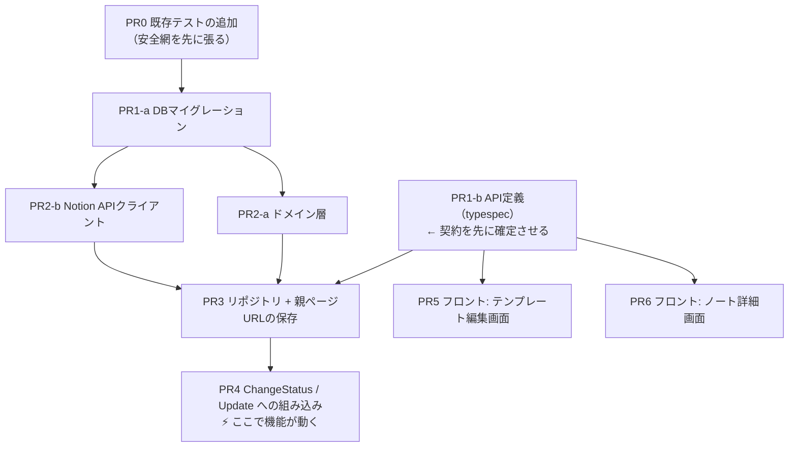

# ④ 段取りとPR分割

> **この章でやること**
> 1つの機能を、レビュー可能な単位に割る。

---

## 巨大PRはレビューされない

```
変更ファイル15個 / +1200行
   ↓
「うっ…あとで見よう」→ 5日後「LGTM」（ちゃんと見ていない）
   ↓
バグがすり抜ける
```

さらに、マイグレーション+API+画面が1つに入っていると、
**画面の文言だけ直したくても revert でテーブルごと消えます**。

---

## 分割の3原則

```
1. 常にmainが動く状態を保つ
   → どのPRをマージしてもアプリは壊れない

2. 1PRは1つの関心事だけ
   → レビュアーが「何を見ればいいか」わかる

3. 下の層から積み上げる
   → DB → Domain → UseCase → API → 画面
```

**まだ使われないコードを先に入れてよい**のがポイントです。
誰も呼ばないコードは、マージしても挙動が1ミリも変わりません。

---

## PR分割案（9本）



**枝分かれしているものは並行できます。**

```
PR1-a と PR1-b   … DBとAPI定義は無関係
PR2-a と PR2-b   … ドメインとクライアント
PR5   と PR6     … 画面が別
PR3-4 と PR5-6   … バックエンドとフロント
```

**PR1-b（API定義）を先に出すのがポイントです。**
型が確定すれば、バックエンド（PR3-4）とフロント（PR5-6）を**同時に書けます**。
フロントは生成された型を使うだけなので、バックエンドの完成を待ちません。
（動作確認だけは後回しになります）

> **PR5 を PR6 より先に出します**
> テンプレートに親ページを設定できないと、ノート詳細画面で試せることが
> ほとんどありません（公開ボタンが常に非活性になる）。
> 並行して書けますが、**マージの順序は PR5 が先**です。


### PR0 既存テストの追加 ⚠️

```
目的: これから変更するコードに安全網を張る
変更: note_command_interactor_test.go を新規作成（+250行）
```

第2章のとおり `NoteCommandInteractor` にはテストがありません。
PR4でこのファイルを変更するので、**先に現状の振る舞いを固定**します。

```
□ ChangeStatus: Draft⇄Publish、権限エラー、不正な遷移、ReadModel更新
□ Update: タイトル・セクション更新、権限エラー、空タイトル
□ Create / Delete も同様
```

**受け入れ基準**

```
□ usecase のカバレッジが 37.2% → 70%以上
□ プロダクションコードを1行も変更していない
```

> これは「ついでの改善」ではなく、**今回変更するコードの安全確保**です。
> 別チケットにすると、PR4で無防備な変更をすることになります。

### PR1-a DBマイグレーション

```
変更: migrations/ に up/down 2ファイル（+40行）
```

```sql
ALTER TABLE templates  … notion_parent_page_id を追加（NULL許容）
ALTER TABLE notes      … notion_page_id / url / synced_at を追加（NULL許容）
```

**受け入れ基準**

```
□ up/down が両方動く
□ 既存行がエラーにならない（NULL許容の確認）
□ sqlc generate の生成物をコミット
```

### PR1-b API定義（typespec）

```
変更: api-schema/typespec/ と 3箇所の生成物（+80行）
依存: なし（PR1-aと並行可）
```

**先に契約を確定させます。** これが出れば、バックエンドとフロントが同時に書けます。

```
template.tsp
  TemplateResponse       + notionParentPageUrl（optional）
  CreateTemplateRequest  + notionParentPageUrl（optional）
  UpdateTemplateRequest  + notionParentPageUrl（optional）

note.tsp
  NoteResponse           + notionPageUrl（optional）
```

**すべて optional にします。** 必須にすると、実装が追いつくまで既存のクライアントが壊れます。

**生成の順序**

```
1. typespec を編集
2. api-schema で pnpm openapi   → openapi.yaml
3. backend-clean で make oapi   → Goの型
4. frontend で pnpm openapi     → TSの型
```

**受け入れ基準**

```
□ 3つの生成物がすべてコミットされている
□ 再生成しても差分が出ない
□ 追加したフィールドがすべて optional
□ 既存のビルドとテストが通る（型が増えただけなので壊れないはず）
```

> **なぜ先に出すのか**
> API定義が後回しだと、フロントは型が無いので着手できません。
> 先に確定させれば、**中身が空のままでも画面を書き始められます**。

### PR2-a ドメイン層

```
変更: internal/domain/notion/ を新規作成（+150行）
依存: なし（PR1-aと並行可）
```

```go
type Sync struct {
    NotionPageID *string   // nil なら未連携
    ...
}

func (s *Sync) IsFirstSync() bool { return s == nil || s.NotionPageID == nil }
```

**受け入れ基準**

```
□ ドメイン層が外部に依存していない（net/http も database/sql も import しない）
□ カバレッジ90%以上（既存の domain/service は100%）
□ 既存コードから一切参照されていない（＝影響ゼロ）
```

### PR2-b Notion APIクライアント

```
変更: internal/adapter/gateway/externalapi/notion/ を新規作成（+250行）
```

**受け入れ基準**

```
□ 🚨 http.Client に Timeout を設定（デフォルトは無限で危険）
□ リトライは 429 と 5xx のみ（4xxはリトライしない）
□ テストで実際のNotion APIを呼んでいない（httptest を使う）
□ ベースURLを差し替え可能にする（テスト用）
□ APIキーがログに出ない
```

### PR3 リポジトリ + 親ページURLの保存

```
変更: gateway/db, template_interactor, controller（+200行）
依存: PR1-b②③
```

PR1-b で確定したAPIに、バックエンドの実装を入れます。
テンプレート編集でNotionのURLを受け取り、32文字のIDを抽出して保存します。

**受け入れ基準**

```
□ テンプレートに親ページURLを設定できる
□ URLからIDが正しく抽出される（ハイフン有無の両方）
□ レスポンスに notionParentPageUrl が返る
□ 既存コードの振る舞いは変わっていない（PR0のテストが通る）
```

> **PR4より先に設定できるようにする**
> 順序が逆だと、リリース前の移行作業ができません。

### PR4 ChangeStatus / Update への組み込み ⚡

```
変更: note_command_interactor.go, ReadModel まわり,
      config.go, initializer.go（+280行）
依存: PR3
```

**⚡ このPRで機能が動き出します。同時に、最もリスクが高いPRです。**

**ReadModel 側も通します**（CQRSなので、ここを忘れると画面に出ません）。

```
note.ReadModel 構造体          … NotionPageURL を追加
toReadModel()                  … コピー処理を1行追加  ← 忘れやすい
note_read_model_repository.go  … SELECT / UPSERT に追加
readModelToResponse()          … レスポンスへの変換
```

**受け入れ基準**

```
□ 🚨 PR0で追加した既存テストが全てパスする（デグレなし）
□ 🚨 トランザクションの中でNotion APIを呼んでいない
□ 🚨 入力の検証を済ませてからNotionを呼んでいる
□ 🚨 Notionを先に呼び、成功後にDBを更新している
□ 🚨 toReadModel() でコピーされ、APIレスポンスに notionPageUrl が出る
□ QA-01〜04（正常系）が通る
□ QA-20（Notion失敗時に公開されない）が通る
□ QA-22（設定未投入でも起動する）が通る
□ QA-30b（親ページ未設定でAPIがエラー）が通る
□ QA-36（入力を弾いたときNotionを書き換えない）が通る
```

### PR5 テンプレート画面 + 使用中テンプレートの編集解禁

```
変更: frontend/src/features/template/
      backend: ReplaceFields と項目の保護
依存: PR1-b
```

```
- テンプレート作成・編集画面に「NotionのURL」入力欄
- 詳細画面に設定済みURLを表示
- 使用中テンプレートでも編集画面に入れるようにする
  - ReplaceFields を「全削除→再作成」から差分更新へ
  - 使用中の項目の変更・削除はAPIで拒否（400）
  - 画面でも項目を非活性にする
```

**受け入れ基準**

```
□ URL欄が表示され、入力・保存できる
□ 未入力でも保存できる（optional）
□ QA-14 使用中テンプレートにも設定できる
□ QA-37 使用中の項目は変更できない（画面・APIとも）
□ 既存ノートのセクションが壊れていない
```

> **当初は「入力欄を足すだけ」の想定でした**
> 使用中テンプレートが編集画面に入れないことに、実装中に気づきました。
> 第2章③の「触る範囲」を洗う時点で拾えたはずの見落としです。

### PR6 フロント: ノート詳細画面

```
変更: frontend/src/features/note/（+180行）
依存: PR1-b のみ（バックエンド実装を待たない）
```

```
- 「Notionで開く」リンク（公開中 かつ notionPageUrl がある場合）
- 親ページ未設定なら公開ボタンを非活性にし、理由を表示
- 公開/非公開の失敗時にエラー表示
- 公開済み & 未連携のノートに「連携する」ボタン
```

**受け入れ基準**

```
□ QA-30（親ページ未設定で公開ボタンが非活性）
□ QA-23（公開済み未連携のノートにボタンが出る）
□ QA-34（処理中はボタンが無効化される）
□ 公開失敗時にエラー内容が表示される
□ notionPageUrl が無いときリンクを出さない（既存データ対応）
```

> **バックエンドを待たずに書けます**
> PR1-b で型が確定しているので、レスポンスに値が入る前から画面を作れます。
> 動作確認だけ PR4 のマージ後になります。

## PR一覧

| PR | 内容 | 行数 | 依存 | リスク | レビュー重点 |
|:---:|---|---:|:---:|:---:|---|
| 0 | 既存テスト追加 | ~250 | - | 🟢 ゼロ | カバレッジが上がったか |
| 1-a | マイグレーション | ~40 | 0 | 🟢 低 | NULL許容、sqlc再生成 |
| 1-b | **API定義（typespec）** | ~80 | - | 🟢 低 | **すべて optional か** |
| 2-a | ドメイン層 | ~150 | 1-a | 🟢 ゼロ | 依存の方向 |
| 2-b | Notionクライアント | ~250 | 1-a | 🟢 ゼロ | タイムアウト、リトライ |
| 3 | リポジトリ+親ページ保存 | ~200 | 1-b, 2-a, 2-b | 🟡 中 | テンプレート編集への影響 |
| 4 | **既存メソッドへの組み込み** | ~280 | 3 | 🔴 **高** | **PR0のテストが通るか** |
| 5-a | フロント: テンプレート編集 | ~120 | 1-b | 🟢 低 | — |
| 5-b | フロント: ノート詳細 | ~180 | 1-b | 🟡 中 | 非活性、二重送信防止 |

> **リスクがPR4に集中しているのは良い状態です**
> 「このPRだけ慎重に見ればいい」とわかるからです。
> 全PRが🟡だと、どこを重点的に見ればいいかわかりません。

---

## 設定で切り替えられるようにする

PR4で既存の公開機能を変更するので、「連携をオフにして従来どおり動かす」手段が要ります。

```go
if cfg.NotionAPIKey == "" {
    // 連携をスキップして、従来どおりの公開処理
    return u.changeStatusWithoutNotion(ctx, input)
}
```

```
□ 連携部分だけを切り離して動作確認できる
□ トークンが無い開発者も、既存機能の開発を続けられる
□ 不具合が出たとき、設定を外せば切り分けられる
```

> **恒久的な分岐にはしないこと**
> 全テンプレートに親ページを設定したら、このフォールバックは削除します。
> 残すと「連携されない公開」が永久に可能になり、第2章の前提が崩れます。

---

## スケジュール例

**1人でやる場合**

```
Day 1  PR0    既存テスト
Day 2  PR1-a  マイグレーション ／ PR1-b  API定義
Day 3  PR2-a  ドメイン層 ／ PR2-b  Notionクライアント
Day 4  PR3    リポジトリ+親ページ保存
Day 5  PR4    既存メソッドへの組み込み
Day 6  PR5 / PR6      フロント
Day 7  親ページの設定 → 本物のNotionと繋いで確認
```

**2人でやる場合**

```
        バックエンド担当              フロント担当
Day 1   PR0   既存テスト               （待ち）
Day 2   PR1-a ／ PR1-b API定義   ──┐
Day 3   PR2-a ／ PR2-b            ├→ PR5 テンプレート編集
Day 4   PR3                        │   PR6 ノート詳細
Day 5   PR4                      ──┘
Day 6   結合して確認
```

**PR1-b を Day 2 に出すことで、フロントが3日早く着手できます。**

## PRテンプレート

````markdown
## 何をするPRか
Notion連携のためのテーブル列を追加します。

## なぜ必要か
[02_design_policy.md](./02_design_policy.md) の③の決定に基づきます。

## 影響範囲
- 既存テーブル: templates と notes に列を追加（NULL許容）
- 既存コード: 変更なし
- 既存の挙動: 変わりません

## レビュー観点
- [ ] NULL許容になっているか（既存行が壊れないか）
- [ ] down で戻せるか
- [ ] sqlc の生成物がコミットされているか

## 確認したこと
- [x] make migrate-up / migrate-down 両方実行
- [x] go test ./internal/... 全てパス
````

---

## チェックリスト

```
□ どのPRをマージしてもmainが動くか
□ 1PRが1つの関心事に絞られているか
□ 各PRに受け入れ基準を書いたか（QAケースと紐づけたか）
□ デグレリスクが高いPRを明示したか
□ 1PRの行数が300行程度に収まっているか
```

---

## 次の章へ

段取りが決まりました。ここまで来ると、実装はAIに任せられます。

👉 [05_implementation.md](./05_implementation.md)
