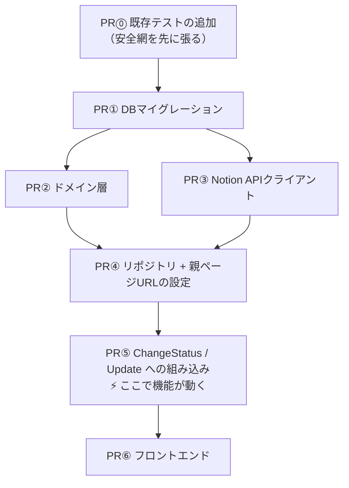

# ④ 段取りとPR分割

> **この章でやること**
> 1つの機能を、レビュー可能な単位に割る。

---

## 巨大PRはレビューされない

```
変更ファイル15個 / +1200行
   ↓
「うっ…あとで見よう」→ 5日後「LGTM」（ちゃんと見ていない）
   ↓
バグがすり抜ける
```

さらに、マイグレーション+API+画面が1つに入っていると、
**画面の文言だけ直したくても revert でテーブルごと消えます**。

---

## 分割の3原則

```
1. 常にmainが動く状態を保つ
   → どのPRをマージしてもアプリは壊れない

2. 1PRは1つの関心事だけ
   → レビュアーが「何を見ればいいか」わかる

3. 下の層から積み上げる
   → DB → Domain → UseCase → API → 画面
```

**まだ使われないコードを先に入れてよい**のがポイントです。
誰も呼ばないコードは、マージしても挙動が1ミリも変わりません。

---

## PR分割案（7本）



PR② と PR③ は並行して進められます。

### PR⓪ 既存テストの追加 ⚠️

```
目的: これから変更するコードに安全網を張る
変更: note_command_interactor_test.go を新規作成（+250行）
```

第2章のとおり `NoteCommandInteractor` にはテストがありません。
PR⑤でこのファイルを変更するので、**先に現状の振る舞いを固定**します。

```
□ ChangeStatus: Draft⇄Publish、権限エラー、不正な遷移、ReadModel更新
□ Update: タイトル・セクション更新、権限エラー、空タイトル
□ Create / Delete も同様
```

**受け入れ基準**

```
□ usecase のカバレッジが 37.2% → 70%以上
□ プロダクションコードを1行も変更していない
```

> これは「ついでの改善」ではなく、**今回変更するコードの安全確保**です。
> 別チケットにすると、PR⑤で無防備な変更をすることになります。

### PR① DBマイグレーション

```
変更: migrations/ に up/down 2ファイル（+40行）
```

```sql
ALTER TABLE templates  … notion_parent_page_id を追加（NULL許容）
ALTER TABLE notes      … notion_page_id / url / synced_at を追加（NULL許容）
```

**受け入れ基準**

```
□ up/down が両方動く
□ 既存行がエラーにならない（NULL許容の確認）
□ sqlc generate の生成物をコミット
```

### PR② ドメイン層

```
変更: internal/domain/notion/ を新規作成（+150行）
依存: なし（PR①と並行可）
```

```go
type Sync struct {
    NotionPageID *string   // nil なら未連携
    ...
}

func (s *Sync) IsFirstSync() bool { return s == nil || s.NotionPageID == nil }
```

**受け入れ基準**

```
□ ドメイン層が外部に依存していない（net/http も database/sql も import しない）
□ カバレッジ90%以上（既存の domain/service は100%）
□ 既存コードから一切参照されていない（＝影響ゼロ）
```

### PR③ Notion APIクライアント

```
変更: internal/adapter/gateway/externalapi/notion/ を新規作成（+250行）
```

**受け入れ基準**

```
□ 🚨 http.Client に Timeout を設定（デフォルトは無限で危険）
□ リトライは 429 と 5xx のみ（4xxはリトライしない）
□ テストで実際のNotion APIを呼んでいない（httptest を使う）
□ ベースURLを差し替え可能にする（テスト用）
□ APIキーがログに出ない
```

### PR④ リポジトリ + 親ページURLの設定

```
変更: gateway/db とテンプレート編集まわり（+200行）
依存: PR①②③
```

テンプレート編集画面でNotionのURLを貼ると、32文字のIDを抽出して保存します。

**受け入れ基準**

```
□ テンプレートに親ページURLを設定できる
□ URLからIDが正しく抽出される（ハイフン有無の両方）
□ 既存コードの振る舞いは変わっていない（PR⓪のテストが通る）
```

> **PR⑤より先に設定できるようにする**
> 順序が逆だと、リリース前の移行作業ができません。

### PR⑤ ChangeStatus / Update への組み込み ⚡

```
変更: note_command_interactor.go, config.go, initializer.go（+250行）
依存: PR④
```

**⚡ このPRで機能が動き出します。同時に、最もリスクが高いPRです。**

**受け入れ基準**

```
□ 🚨 PR⓪で追加した既存テストが全てパスする（デグレなし）
□ 🚨 トランザクションの中でNotion APIを呼んでいない
□ 🚨 Notionを先に呼び、成功後にDBを更新している
□ QA-01〜04（正常系）が通る
□ QA-20（Notion失敗時に公開されない）が通る
□ QA-22（設定未投入でも起動する）が通る
□ QA-30b（親ページ未設定でAPIがエラー）が通る
```

### PR⑥ フロントエンド

```
変更: frontend/src/features/note/ と template/（+300行）
依存: PR⑤
```

```
- テンプレート編集画面に親ページURLの入力欄
- ノート詳細に「Notionで開く」リンク（公開中のみ）
- 親ページ未設定なら公開ボタンを非活性にし、理由を表示
- 公開済み & 未連携のノートに「連携する」ボタン
```

**受け入れ基準**

```
□ QA-30（親ページ未設定で公開ボタンが非活性）
□ QA-23（公開済み未連携のノートにボタンが出る）
□ QA-34（処理中はボタンが無効化される）
□ 公開失敗時にエラー内容が表示される
```

---

## PR一覧

| PR | 内容 | 行数 | 依存 | リスク | レビュー重点 |
|:---:|---|---:|:---:|:---:|---|
| ⓪ | 既存テスト追加 | ~250 | - | 🟢 ゼロ | カバレッジが上がったか |
| ① | マイグレーション | ~40 | - | 🟢 低 | NULL許容、sqlc再生成 |
| ② | ドメイン層 | ~150 | - | 🟢 ゼロ | 依存の方向 |
| ③ | Notionクライアント | ~250 | ② | 🟢 ゼロ | タイムアウト、リトライ |
| ④ | リポジトリ+親ページ設定 | ~200 | ①②③ | 🟡 中 | テンプレート編集への影響 |
| ⑤ | **既存メソッドへの組み込み** | ~250 | ④ | 🔴 **高** | **PR⓪のテストが通るか** |
| ⑥ | フロントエンド | ~300 | ⑤ | 🟡 中 | 非活性、二重送信防止 |

> **リスクがPR⑤に集中しているのは良い状態です**
> 「このPRだけ慎重に見ればいい」とわかるからです。
> 全PRが🟡だと、どこを重点的に見ればいいかわかりません。

---

## 設定で切り替えられるようにする

PR⑤で既存の公開機能を変更するので、「連携をオフにして従来どおり動かす」手段が要ります。

```go
if cfg.NotionAPIKey == "" {
    // 連携をスキップして、従来どおりの公開処理
    return u.changeStatusWithoutNotion(ctx, input)
}
```

```
□ 連携部分だけを切り離して動作確認できる
□ トークンが無い開発者も、既存機能の開発を続けられる
□ 不具合が出たとき、設定を外せば切り分けられる
```

> **恒久的な分岐にはしないこと**
> 全テンプレートに親ページを設定したら、このフォールバックは削除します。
> 残すと「連携されない公開」が永久に可能になり、第2章の前提が崩れます。

---

## スケジュール例

```
Day 1  PR⓪ 既存テスト追加
Day 2  PR① マイグレーション ／ PR② ドメイン層（並行）
Day 3  PR③ Notionクライアント
Day 4  PR④ リポジトリ+親ページ設定
Day 5  PR⑤ 既存メソッドへの組み込み
Day 6  PR⑥ フロントエンド
Day 7  親ページの設定 → 本物のNotionと繋いで確認
```

**クリティカルパス: ⓪ → ① → ④ → ⑤ → ⑥**

PR⓪で1日増えますが、PR⑤で壊したときの手戻りより安いです。

---

## PRテンプレート

````markdown
## 何をするPRか
Notion連携のためのテーブル列を追加します。

## なぜ必要か
[02_design_policy.md](./02_design_policy.md) の③の決定に基づきます。

## 影響範囲
- 既存テーブル: templates と notes に列を追加（NULL許容）
- 既存コード: 変更なし
- 既存の挙動: 変わりません

## レビュー観点
- [ ] NULL許容になっているか（既存行が壊れないか）
- [ ] down で戻せるか
- [ ] sqlc の生成物がコミットされているか

## 確認したこと
- [x] make migrate-up / migrate-down 両方実行
- [x] go test ./internal/... 全てパス
````

---

## チェックリスト

```
□ どのPRをマージしてもmainが動くか
□ 1PRが1つの関心事に絞られているか
□ 各PRに受け入れ基準を書いたか（QAケースと紐づけたか）
□ デグレリスクが高いPRを明示したか
□ 1PRの行数が300行程度に収まっているか
```

---

## 次の章へ

段取りが決まりました。ここまで来ると、実装はAIに任せられます。

👉 [05_implementation.md](./05_implementation.md)
